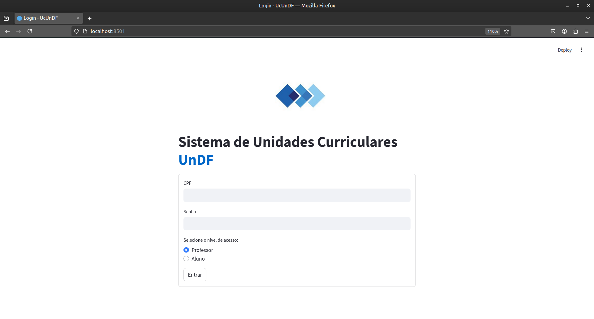
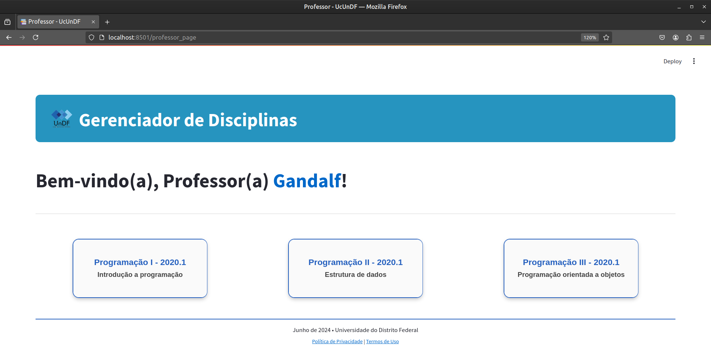
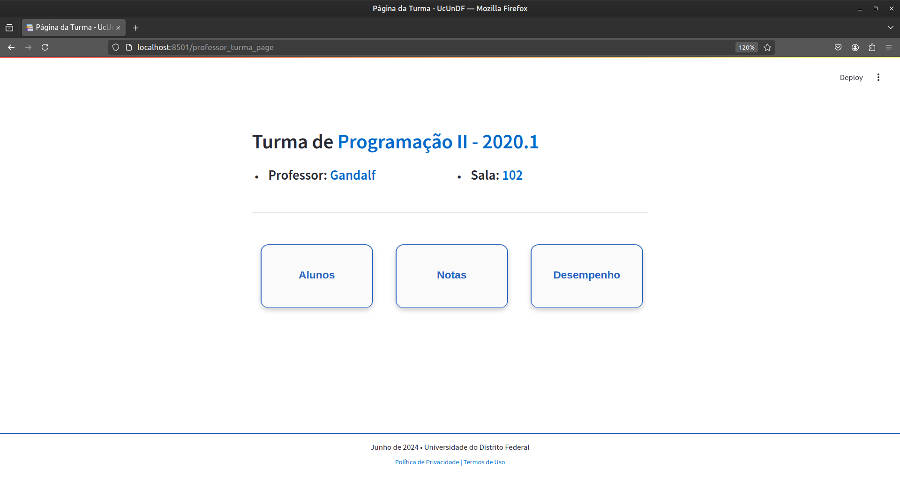
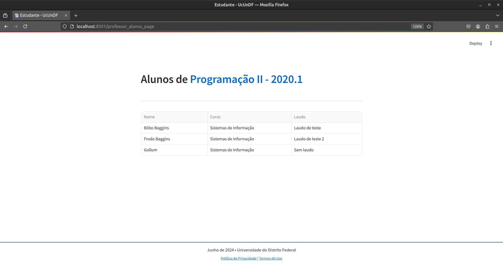
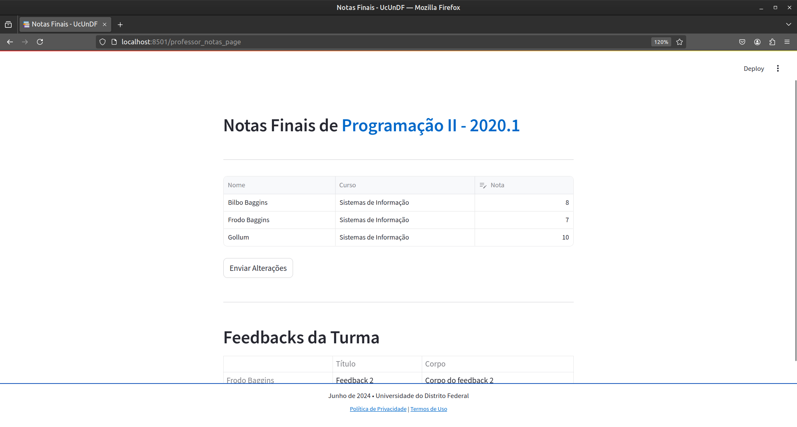
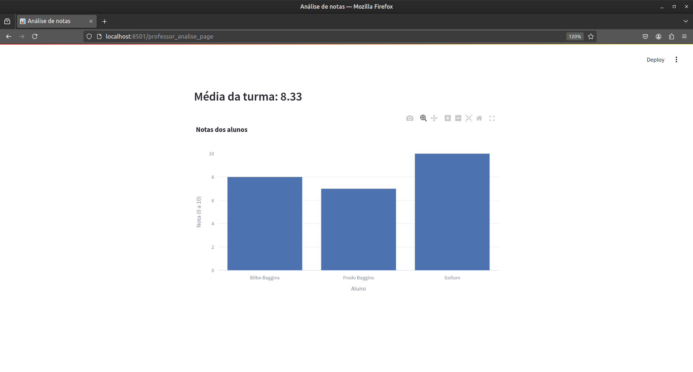
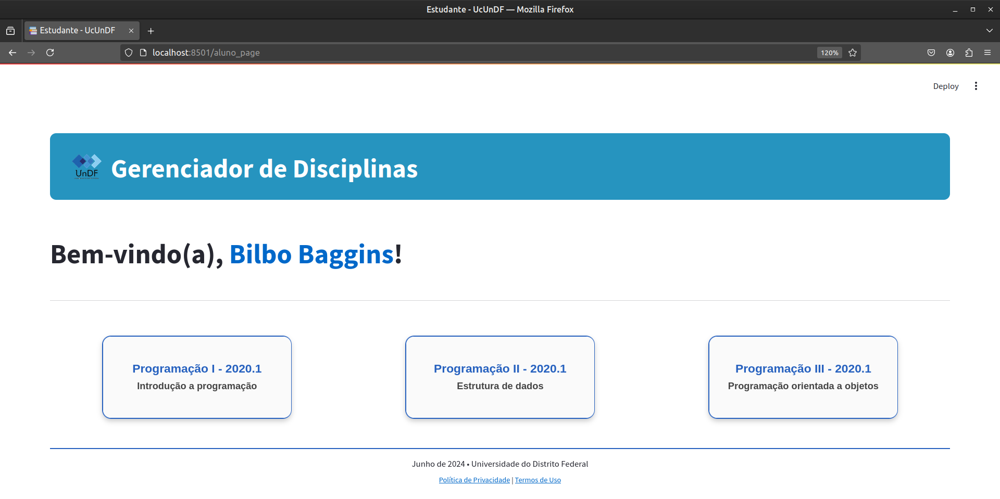
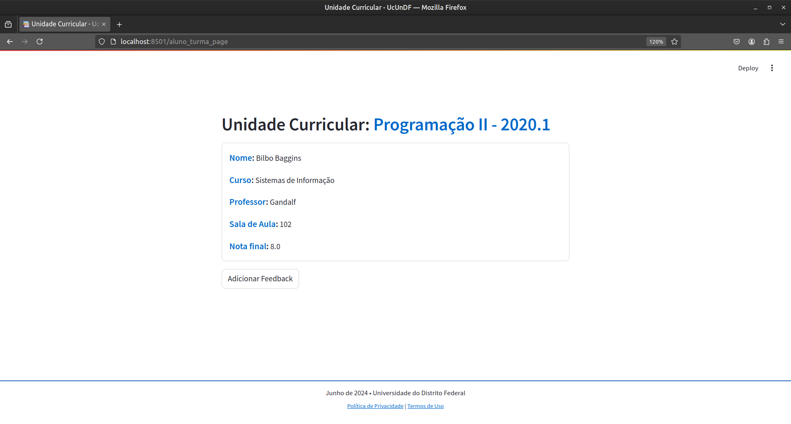
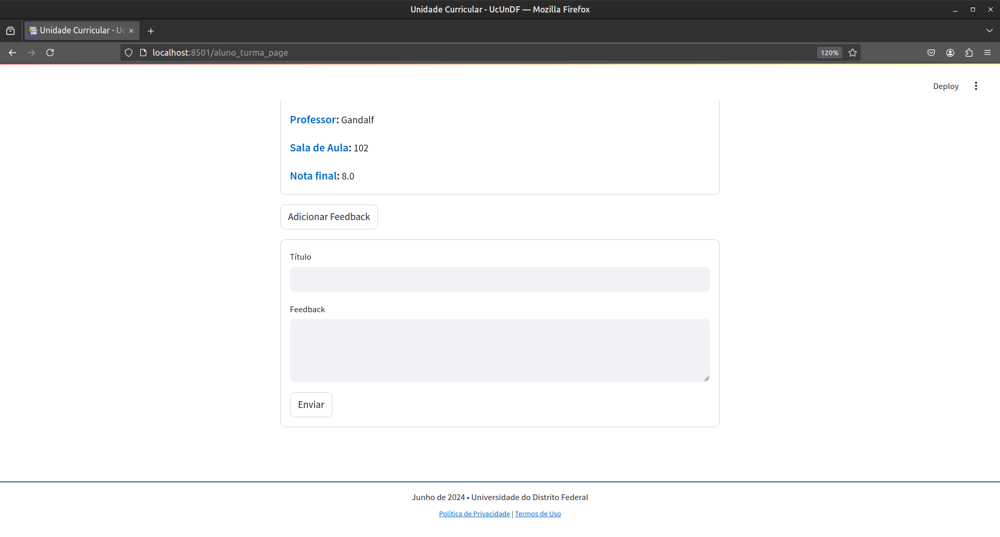

# Gerenciador de Unidades Curriculares
- Projeto feito para a matéria de "Projeto Aplicado".

## Guia de Utilização:
1. Suba o banco de dados na porta '3306', usando o arquivo 'script.sql' que se localiza na pasta 'db'.
    - Confira se o banco está na porta correta!
2. Instale as dependências do ambiente virtual do Python: 
- ```python
    pip install -r requirements.txt
3. Após instalar as dependências, você pode subir o servidor com o seguinte comando:
- ```python
    streamlit run login_page.py
4. Agora você pode ligar o servidor 'Spring Boot' da aplicação, abra sua IDE de Java e rode o arquivo 'UndfApplication'.

### - A aplicação está pronta para ser usada!

## Screenshots:


### - Aba de Acesso do Professor:







### - Aba de Acesso do Estudante:



